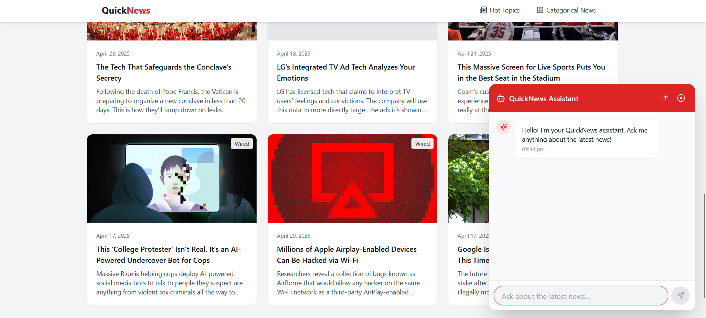

# QuickNews - Fast, Simple News Delivery


QuickNews is a modern news delivery platform that provides concise, AI-powered news summaries to help users stay informed efficiently.

## Features

### 1. Smart News Aggregation
- Real-time scanning of thousands of news sources
- AI-powered analysis and summarization
- Trending topics visualization


### 2. Time-Saving Design
- Reduce news reading time from 70 to 12 minutes
- Quick-scan headlines and summaries
- Categorized news sections for easy navigation


### 3. Key Features
- 🔥 Real-time trending topics
- 📰 Category-based browsing
- 🤖 AI-powered summaries
- ⏳ Customizable time frames

## Technology Stack

- Next.js 
- React
- Tailwind CSS
- Framer Motion
- RadixUI Components
- Lucide Icons

## Getting Started

1. Clone the repository:
```bash
git clone https://github.com/Deeppanchal2108/QuickNews.git